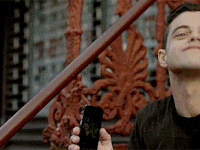

<h1 align="center">Hi 👋, I'm Alissa Troiano</h1>
<h4 align="center">
	I'm a creative, results-driven full-stack software developer with a frontend focus and a knack for planning, executing & maintaining effective software solutions that solve user & business needs.
</h4>

<h5>About me:</h5>

- 🎨 I'm really great at: **User Experience Design & User Interface Development**
- 💡 I'm known for: **Ideation, Leading Teams during Hackathon, and meaningful Software Design**
- 😍 I just love **Animations!**
- 👩‍🎓 I'm currently mastering **AI & AI Prompt Engineering**
- 🎉 I have the most fun with: **Interaction Design and Gameifying Software**
- 😲 Most people don't know this, but: **I love to include fun, relevant, 404 ERROR pages into most all of my projects**

👩‍💻 You can view all my projects by checking out my 💼 [Portfolio](https://alissatroiano.com) or staying right here on my [GitHub](https://github.com/alissatroiano)

***

 *** 

<h1 align="center">Connect with me:</h1>

